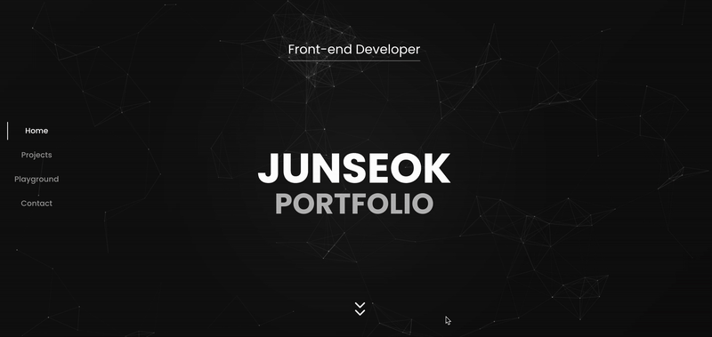
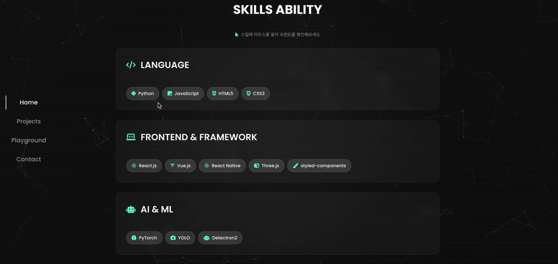
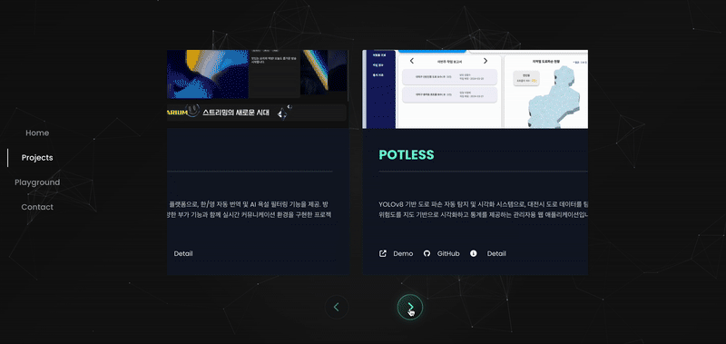
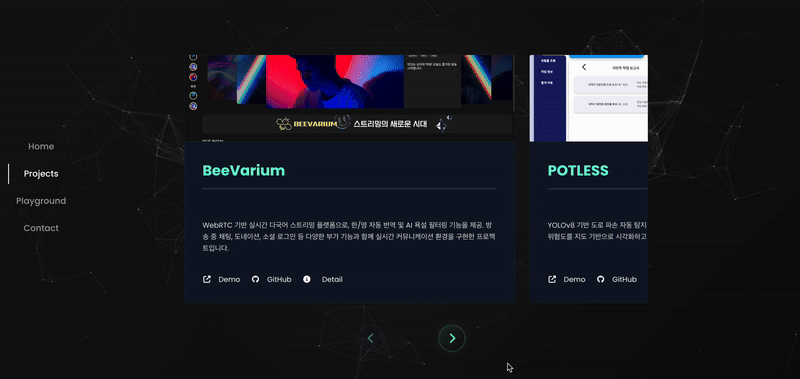
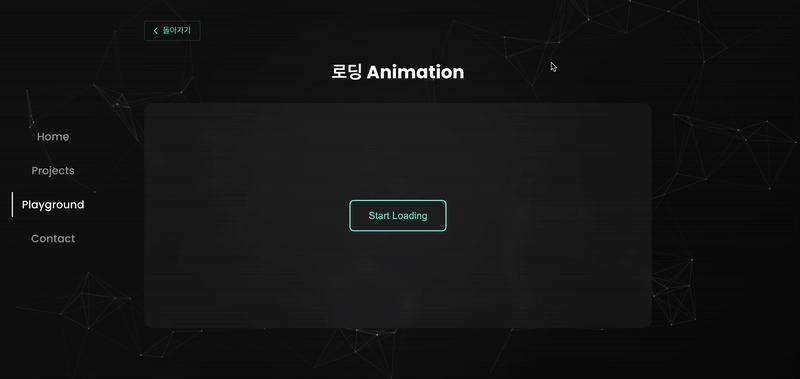
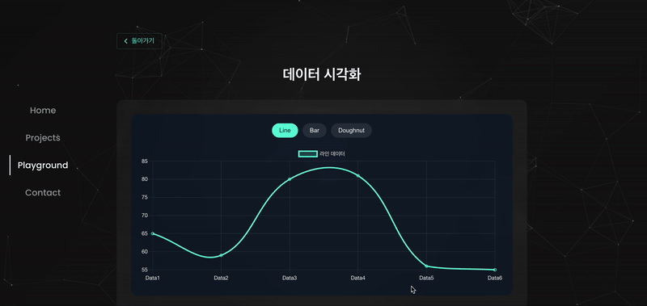
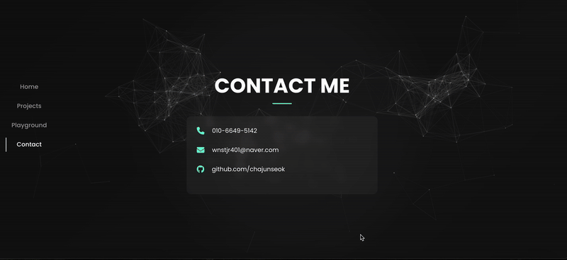
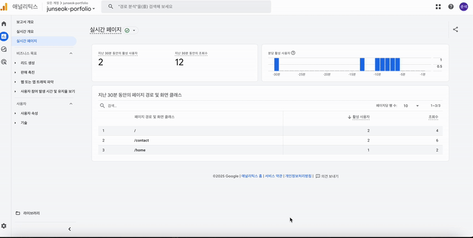

# 🖥️ Portfolio Website

개인 포트폴리오 웹사이트로, 프로필 소개부터 프로젝트 정리, 다양한 시각 효과, 모듈화된 기술 데모와 미니 게임 등을 통해  
**프론트엔드 개발 역량**을 효과적으로 보여주는 프로젝트입니다.


[👉 Live Demo 바로가기](https://chajunseok.github.io/)



---
## 🔸 주요 섹션 소개
### 🏠 1. Home

- 포트폴리오의 시작 페이지이자 개발자 소개 공간입니다.
- 기술 스택, 이력, 수상 내역을 **애니메이션 효과와 함께 시각적으로 구성**하였습니다:

#### 📌 보유 기술 스택

- 기술 아이콘에 **마우스를 올리면**, 해당 기술로 가능한 작업과 경험 수준이 **툴팁 형태로 표시**됩니다.
- 예: JavaScript에 hover 시 → “ES6+, 비동기 처리, 모듈화 개발 가능, 알고리즘 학습” 등의 설명이 노출


> 📷 예시  
> 

---

### 📁 2. Projects

- 각 프로젝트를 **슬라이드 카드(Carousel)** 형식으로 나열
- 각 카드에는 다음 기능이 포함되어 있습니다:
  - 🔗 데모 사이트 이동
  - 💻 GitHub 저장소 연결
  - 🔍 상세 정보 모달 열기

> 📷 예시  
> 

#### 📑 모달 상세 구성

- 프로젝트 소개 및 목적
- 기능 구조 및 주요 기능
- 사용 기술과 선정 이유
- 실제 담당 역할
- 트러블슈팅 내용
- 프로젝트 회고 및 리뷰

> 📷 예시  
> 

---

### 🧪 3. Playground

- **사용자 경험 향상을 위한 기술 실험 공간**입니다.  
- 다양한 시각 효과, 기능, 게임 등을 직접 체험하며, 실제 서비스에 어떻게 적용될 수 있는지를 확인할 수 있습니다.  
- 각 요소는 **모듈화되어 개별적으로 관리**되며, UI/UX 최적화를 위한 실험 사례로 구성되어 있습니다.

#### 💡 Effects
- 음악 시각화(Music Animation)
- 마우스 Hover 애니메이션
- 타임라인 기반 애니메이션
- 스크롤 트리거 애니메이션
- 로딩 전환 효과 등

> 📷 예시  
>   
> 

#### 🧠 Tech Demos
- Chart.js 기반 데이터 시각화
- html2canvas + jsPDF를 이용한 PDF 다운로드
- 무한 스크롤 구현
- 필터링 & 드래그 가능한 캐러셀 등

> 📷 예시  
>   
> 

#### 🎮 Challenge Games
- Three.js 기반 3D 뷰어
- 카드 매칭 게임
- 틱택토
- 계산기

> 📷 예시  
>   

---

### 📬 4. Contact

- 방문자가 쉽게 연락할 수 있도록 구성된 정보 섹션입니다.
- 전화번호, 이메일, 소셜 링크를 포함합니다.
- ✉️ 이메일 복사 버튼
- 🔗 GitHub 소셜 링크

> 📷 예시  
> 

---

## 📁 프로젝트 폴더 구조

```
src/
├── components/
│   ├── effects/       # 애니메이션 효과 컴포넌트
│   ├── tech/          # 기술 데모 컴포넌트
│   └── games/         # 미니 게임 컴포넌트
├── features/
│   └── profile/       # 프로필, 기술스택, 수상경력 등
├── pages/             # 페이지 컴포넌트 (Home, Projects 등)
├── styles/            # 전역 및 모듈 스타일 정의
├── utils/             # 공통 유틸리티 함수
└── main.jsx           # 엔트리 포인트
```

---

## 🛠 기술 스택

- React
- Styled-components
- Framer Motion
- Three.js
- Chart.js
- React Router
- Vite
- html2canvas / jsPDF
- GA4 (Google Analytics 4)

---

## 🎨 UI/UX 특징

- 다크 테마 지원
- 부드러운 모션 애니메이션
- Particles.js 배경 효과
- 직관적인 탭 및 네비게이션 구조

---

## 📊 GA4 연동

- HashRouter 환경에서도 페이지뷰 추적 가능
- `logPageView()`를 활용한 수동 페이지 추적
- 클릭 등 주요 사용자 이벤트 기록

> 📷 예시  
> 

---

## 🙋‍♂️ 개발자 정보

- **차준석 | Frontend Developer**
- 📬 chajunseok.dev@gmail.com
- 🌐 [Portfolio Site](https://chajunseok.github.io/)
- 🐙 [GitHub](https://github.com/chajunseok)
