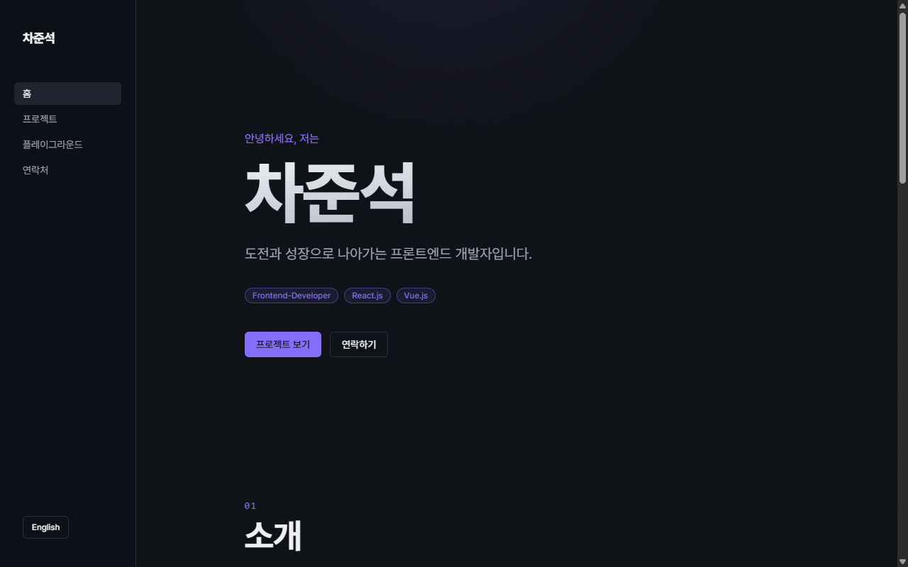
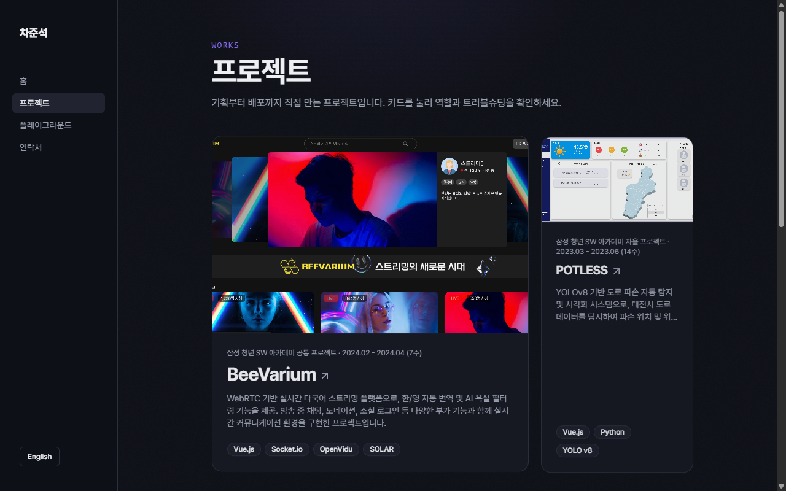
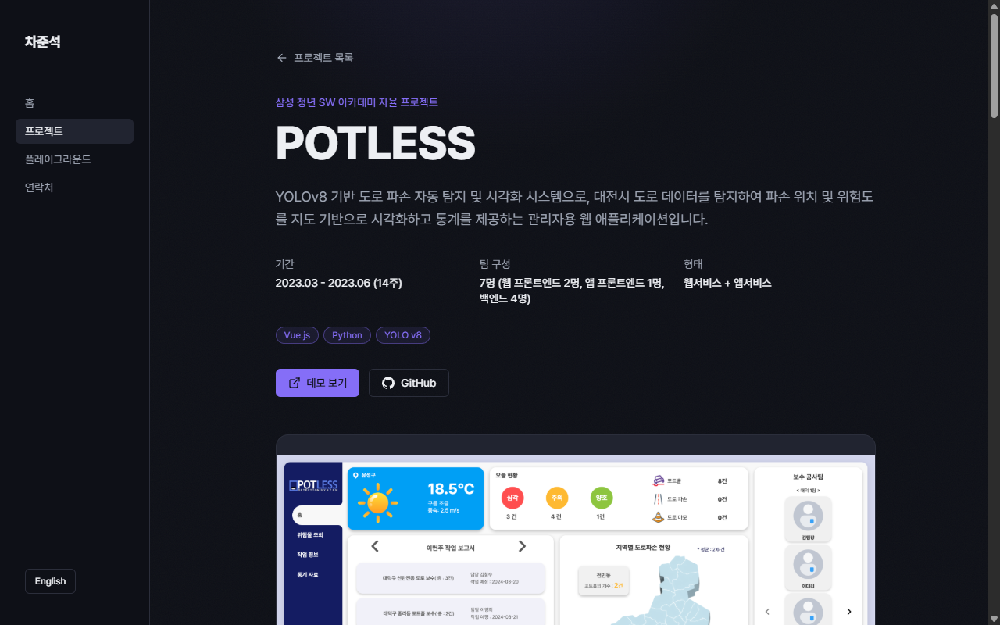
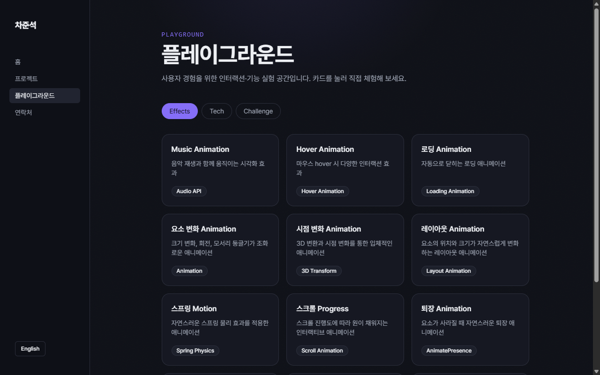

# 🖥️ Portfolio Website

프론트엔드 개발자 차준석의 개인 포트폴리오입니다. 프로필·프로젝트 정리와 함께,
인터랙션·기능 실험 데모 26개를 직접 체험할 수 있는 **Playground**를 담고 있습니다.

[👉 Live Demo 바로가기](https://chajunseok.github.io/)



---

## 🔸 주요 화면

### 🏠 Home

- 이름·역할·태그가 순차 등장하는 히어로, 소개, 기술 스택, 경력·학력·수상 타임라인
- 기술 스택은 분류 탭(언어 · 프레임워크 · AI · 도구)으로 나뉘고, 화면에 들어올 때 숙련도 바가 채워집니다
- 배경은 은은한 grain 질감 + 포인터를 따라 움직이는 spotlight

### 📁 Projects

- 대표 프로젝트를 크게 두는 bento 그리드. 카드 위에서 포인터를 따라 빛이 움직입니다
- 카드를 누르면 **공유 가능한 전용 URL**(`#/projects/{id}`)의 상세 페이지로 이동합니다
- 상세: 개요 · 주요 기능 · 기술 선정 이유 · 담당 역할 · 트러블슈팅 · 회고, 데모/GitHub 링크




### 🧪 Playground

사용자 경험을 위한 인터랙션·기능 실험 공간입니다. 데모마다 전용 URL(`#/playground/{id}`)이 있고,
무거운 라이브러리(three.js · Chart.js · jsPDF)는 해당 데모를 열 때만 내려받습니다.

| 분류              | 데모                                                                                                                                                  |
| ----------------- | ----------------------------------------------------------------------------------------------------------------------------------------------------- |
| **Effects** (12)  | 음악 시각화, Hover, 로딩, 요소 변화, 시점 변화, 레이아웃, 스프링, 스크롤 Progress, 퇴장, AOS, 모달, 타임라인                                          |
| **Tech** (10)     | 데이터 시각화(Chart.js), PDF 다운로드(jsPDF + html2canvas-pro), 캐러셀, 페이지네이션, 날짜·Select·Input 필터, 토글 사이드바, 무한 스크롤, 플로팅 메뉴 |
| **Challenge** (4) | 3D 뷰어(three.js), 메모리 카드 게임, 틱택토, 계산기                                                                                                   |



### 📬 Contact

- 이메일(복사 버튼 포함) · GitHub · 전화 카드
- 복사 결과는 화면 읽기 프로그램에도 전달됩니다(`aria-live`)

---

## 🏗 아키텍처

```
src/
  app/          # App · router(HashRouter) · providers · layouts(StandardLayout, SideNav)
  pages/        # 화면 엔트리 — 폴더명이 곧 screenId, import.meta.glob으로 자동 등록
  features/     # 도메인별 model(데이터·타입·순수 로직) · ui — index.ts 공개 API만 노출
    profile/  project/  skill/  playground/
  shared/       # 디자인시스템 — ui(원자) · widget · hooks · utils · i18n · analytics
  configs/ · styles/ · test/
```

- **계층 규칙**: `pages → features → shared`. 역방향·features 간 직접 참조는 ESLint(`no-restricted-imports`)가 막습니다.
- **화면 추가**: `pages/{screenId}/index.tsx`를 만들면 라우트에 자동 등록됩니다.
- **프로젝트 추가**: `features/project/model/projects.ts`에 항목 하나 + `public/assets/projects/` 썸네일. 화면 코드 수정 없음.
- **데모 추가**: `features/playground/ui/demos/{id}.tsx` + `model/demos.ts` 카탈로그 한 줄 + `shared/i18n/locales/*.playground.json` 문구.

상세 규칙은 [`CLAUDE.md`](./CLAUDE.md)를 참고하세요.

---

## 🛠 기술 스택

| 분야        | 선택                                              |
| ----------- | ------------------------------------------------- |
| UI / Lang   | React 19 · TypeScript (strict)                    |
| Build       | Vite 8 (Node ≥ 22.12)                             |
| Styling     | Tailwind CSS 4 · CSS 변수 토큰 · CVA              |
| Primitives  | Radix UI · lucide-react                           |
| Motion      | motion (LazyMotion — 첫 화면 이후 로드)           |
| Routing     | react-router-dom `HashRouter`                     |
| i18n        | i18next (한국어 기본 · 영어)                      |
| Playground  | three.js · Chart.js · jsPDF · html2canvas-pro     |
| Docs / Test | Storybook · Vitest + Testing Library · Playwright |
| Lint        | ESLint · Prettier · Husky + lint-staged           |
| Analytics   | GA4 (react-ga4)                                   |

---

## 🚀 실행 · 검증 · 배포

```bash
npm install
npm run dev              # 개발 서버
npm run build            # tsc -b && vite build → dist/
npm run preview          # 빌드 결과 미리보기

npm run lint             # ESLint (계층 규칙 포함)
npm test                 # Vitest
npm run test:e2e         # Playwright (npx playwright install chromium 선행)
npm run storybook        # shared/ui 스토리
```

- GA4를 쓰려면 루트에 `.env` 파일을 만들고 `VITE_GA_MEASUREMENT_ID=G-XXXXXXXXXX`를 넣습니다. 값이 없으면 GA는 켜지지 않습니다.
- 배포는 `main`에 push하면 GitHub Actions(`.github/workflows/deploy.yml`)가 빌드해 `gh-pages` 브랜치로 올립니다. GA ID는 저장소 Secrets의 `VITE_GA_MEASUREMENT_ID`에서 읽습니다.

---

## 📊 GA4 연동

- HashRouter라 GA 자동 페이지뷰는 끄고, 라우트가 바뀔 때 `logPageView()`로 직접 보냅니다 — 프로젝트·데모 상세 URL도 개별 페이지뷰로 잡힙니다.
- 프로젝트 데모/GitHub 링크 클릭, 이메일 복사는 이벤트로 기록합니다.

---

## 🙋‍♂️ 개발자 정보

- **차준석 | Frontend Developer**
- 📬 wnstjr401@gmail.com
- 🌐 [Portfolio Site](https://chajunseok.github.io/)
- 🐙 [GitHub](https://github.com/chajunseok)
